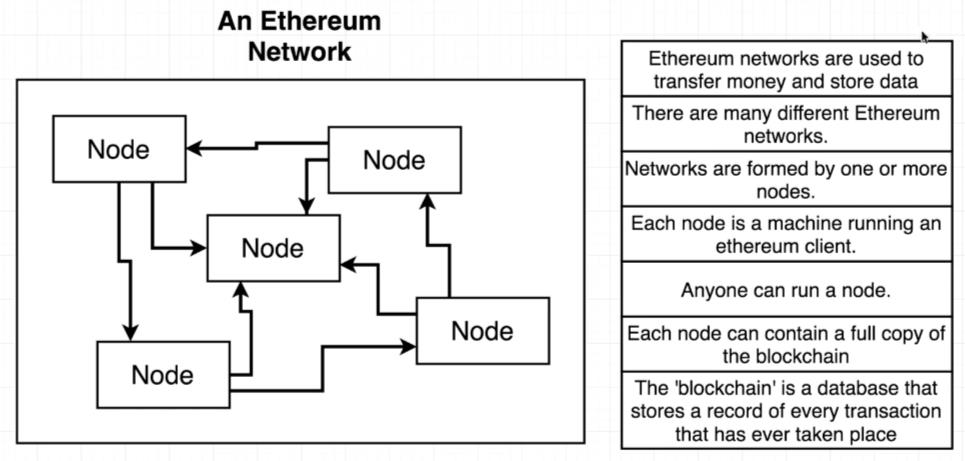
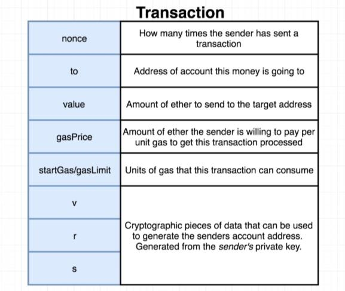
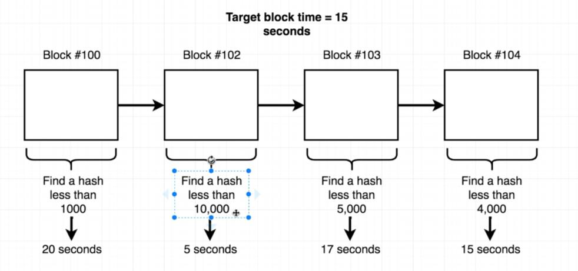
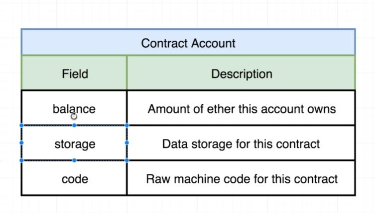

# Ethereum and Solidity

## Fundamentals of Ethereum and Blockchain

### 1. History

- #### Bitcoin: A Peer-to-Peer Electronic Cash System

  - A system to allow peer to peer payments without a financial intermediary (like a bank)
  - Cited transaction reversals as an issue with online commerce - the ability of customers to 'charge back' a purchase

- #### Ethereum: The Ultimate Smart Contract and Decentralized Application Platform
  - The need for more programmatic control over transactions
  - Wanted to enable creation of 'decentralized autonomous corporations' (DAC)
  - Introduces the idea of _'Smart Contracts'_ as an entity that can send and receive currency, beyond just humans

### 2. Ethereum

#### 2.1 What is Ethereum

- Goal of Ethereum: transfer money and store data.
- The 'blockchain' is a database. Each block is like a ledger.

#### 2.2 How to connect to Ethereum Networks

- For Developers:
  - web3.js (portal)
- For Consumers:
  - Metamask
  - Mist Browser

#### 2.3 Metamask Config
- Account Address
- Public Key
- Private Key

#### 2.4 What's a transaction
A transaction is a record of one account attempting to send money to another account

- v, r, and s can be generated from the private key, but it doesn't work the other way around. v, r, and s can only generate the sender's address.

### 3. Blockchain

#### 3.1 Basic Blockchain

- SHA 256 Hash Encryption
  - The hash always has the same length

- Block 
  - Block No. 
  - Nonce (Help generate hash => signed block)
  - Data
  - Prev
=> Hash

- Blockchain
  - Change one block, the subsequent blocks will be invalid.
  - To fix the above problem, we need to re-mine the block, which takes some time. The more blocks we altered, then it's more difficult to validate the chain, since we have to spend a lot more time re-mining.

- Distributed Blockchain
  - make sure the block hasn't been re-mined.
  - Each peer has a copy of the blockchain. Only by checking the most recent hash of one copy can we validate the chain.

- Tokens Blockchain
  - Problem: only shows money movement, no balance. So we don't if the money is transferable.

- Coinbase
  - Coinbase shows the balance of the sender. Each block can trace back to the previous block to validate transaction.

#### 3.2 Block Time
- The entire process to rehash the data along with the incrementing nonce takes time.
- Since the output hash is actually a base-10 number, we can use the number of leading zeros to determine the difficulty of the hash.
- The time to find a hash solution is called the Block Time.

### 4. Smart Contracts

#### 4.1 What is a Smart Contract
A smart contract is an account controlled by code.

- Smart contracts are independent on each Ethereum network. That is, the contract account in Rinkeby is not the same as the contract account in Mainnet. We have to copy the code and re-deploy the contract.