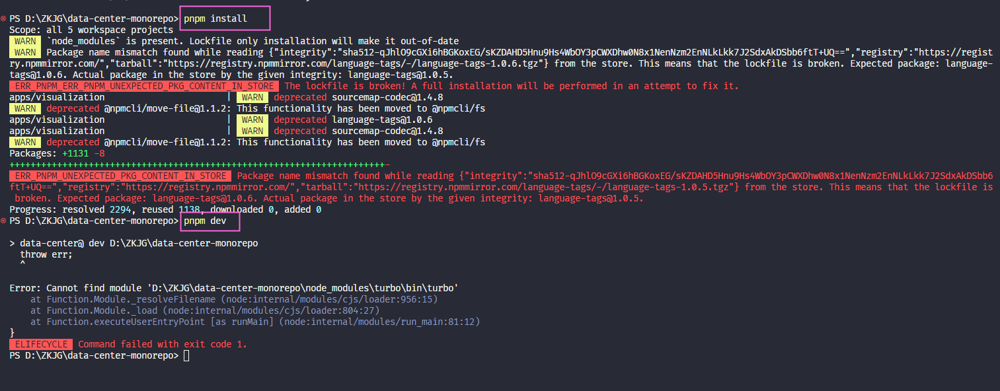
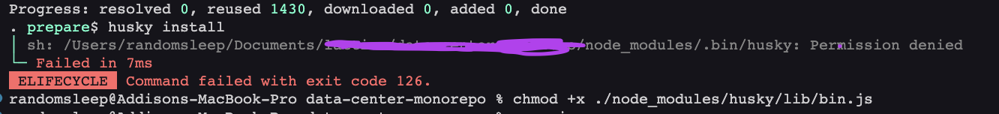

# Bugs and Fixes while Developing
## npm
### 1. node-sass (gyp) error/not working on OSX (M1 chip) machine
fix: downgrade node to 14.15.0 (or a similar old version), if the problem still exists, try not to run npm scripts directly from VS code (switching node versions in terminal does not affect VS code's default settings), instead, type npm commands in the terminal where the node version is downgraded.

## primeVue

### 1. primeVue is not installed!
fix: This problem is usually caused by not having primeVue installed in the machine. So in a new or newly cloned primeVue project, before running ``` pnpm install ```, run the following 2 commands first:```npm install primevue@^3 --save``` and ```npm install primeicons --save``` , to make sure primeVue is installed locally. 

## CSS

### 1. flex column parent, grid child height overflows
fix: set grid child's min-height: 0, because if the grid item is not given a fixed height, its min height is set to auto, and it will expand unexpectedly.

### 2. spacing does not work properly when migrating from Windi CSS to Tailwind CSS 
fix: In Windi css, when using specific unit (e.g. 24px) for spacing, the css class can be written as ```p-24px```, but in Tailwind CSS, the class will not work. There are 3 ways to fix this:
- 1. use ```p-6``` instead of ```p-24px```
- 2. use ```p-[24px]```(TW) instead of ```p-24px```(Windi)
- 3. add ```p-24px: 24px``` to the ```theme``` section in ```tailwind.config.js```

note: TW's spacing rule:
- 1. px / 4 = unit
- 2. rem * 4 = unit

## T3 

### 1. After installed, Echarts-gl library still not working and failed to compile
fix: First, in the chart component, make sure the import order is correct, put ```import 'echarts-gl'``` before ```import * as echarts from 'echarts'```. Second, in the parent component file, use Next's dynamic import to import the chart component, write ```const Chart = dynamic(() => import('./Chart'), { ssr: false })```, and then use ```<Chart />``` in the parent component.

### 2. Create-T3-Turbo App: Error: Pnpm lockfile is broken, a full installation will be performed
- 
fix: delete the .pnpm-store folder (usually located in D drive), and then run ```pnpm install``` again.

### 3. Eslint error: do not use @ts-ignore
fix: add ```// eslint-disable-next-line @typescript-eslint/ban-ts-comment``` before the line of code that uses ```@ts-ignore```. This is because ```@ts-ignore``` is a bad practice, and it is recommended to use ```@ts-expect-error``` instead. However, in some cases, ```@ts-ignore``` is necessary, so we need to disable the eslint rule for this line of code, while still keeping the eslint rule for other lines of code.

note: the same fix can be applied to other eslint rules that are not necessary for some lines of code, like ```no-this-alias ``` etc.

### 4. 3-rd party library not working (cannot read property of null, reading useRef/useState ...)
fix: It's probably because the library's import order is wrong. Specify the package name and version (latest) in the current app's ```package.json``` file, then run ```pnpm i``` in root folder, and run ```format``` to make sure the import order is correct.

note: Since T3 Turbo is a mono-repo, don't run ```pnpm i``` in the app's folder, instead, run ```pnpm i``` in the root folder.

### 5. Husky pre-commit hook permission denied while running `pnpm i`
- 
fix: "Permission denied" means that your script file does not have the "execute" permission set. Run `chmod +x ./node_modules/husky/lib/bin.js` in the root folder. NOTE: `chmod` is a command that changes the permissions of a file or directory. The `+x` option means to add the "execute" permission to the file. And `sudo` won't work here.

## Next.js/React

### 1. Rendered fewer/more hooks than during the previous render
code:
```jsx
// - /pages/monitor.tsx
const Home: React.FC(props) = () {
  // ...hooks here
  return (
    <div>
      // ...jsx here
    </div>
  )
}

export default Home
```
fix: This is because in Next.js, each file in pages folder must be a default export, and it should follow the pattern below, otherwise Next.js wouldn't treat it as a React component, instead, ```Home``` would be treated as a regular JavaScript function. One important rule of hooks is that hooks should be called from React function components. So the code above should be changed to:
```jsx
// - /pages/monitor.tsx
const Home = () => {
  // ...hooks here
  return (
    <div>
      // ...jsx here
    </div>
  )
}

export default function Page () {
  return (
    <>
      <Home />
    </>
  );
}
```

### client-side environment variable not found
fix: In Next.js, all client-side envs should be prefixed with ```NEXT_PUBLIC_```, e.g. ```NEXT_PUBLIC_API_URL```

## Git

### 1. .gitignore not working
fix: Since the node_modules directory is already tracked as part of the repository, the .gitignore rule will not apply to it.

You need to untrack the directory from git using

```
git rm -r --cached node_modules
git commit -m "removing node_modules"
```

After this, the .gitignore rule will ignore the directory away.