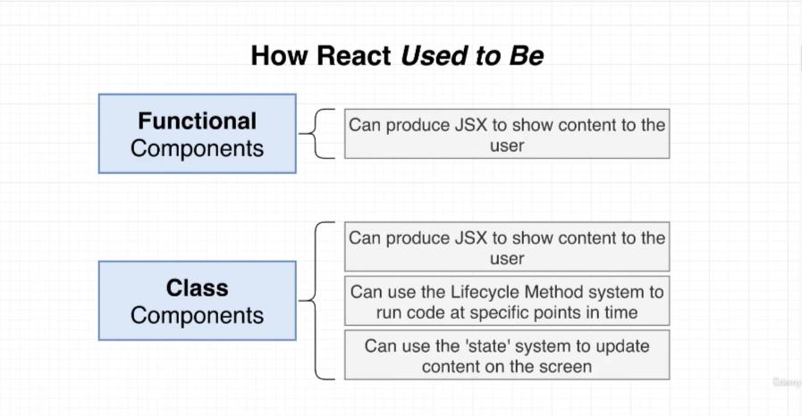
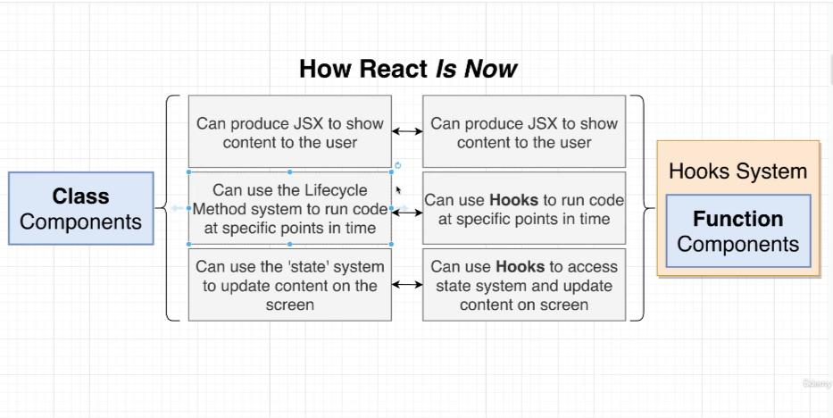
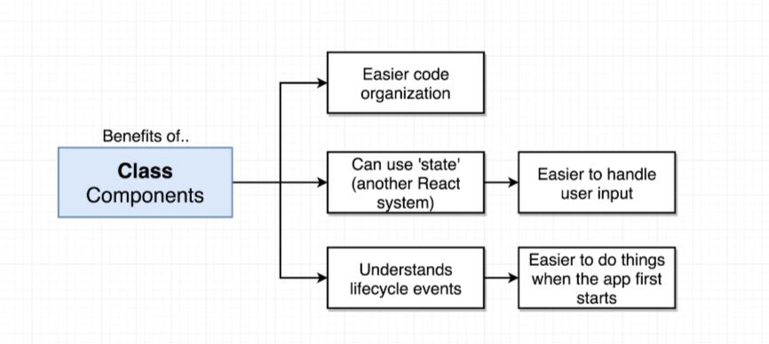
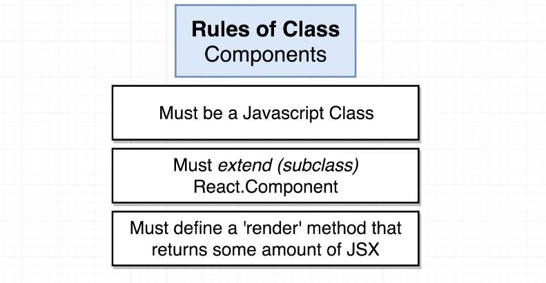
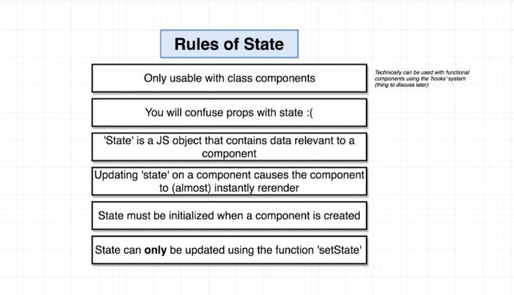
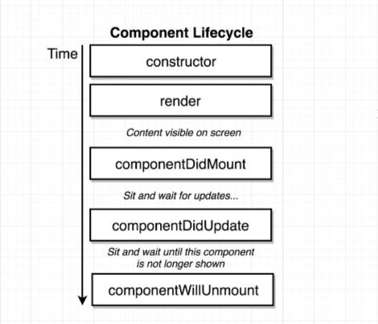
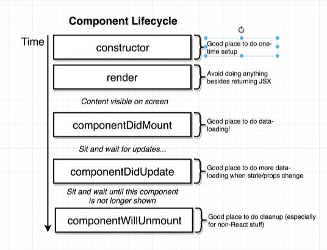
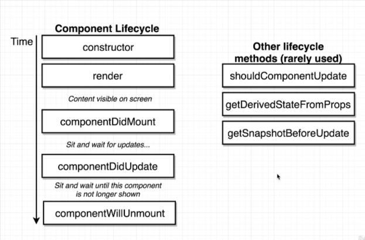

## Functional VS Class Components

### 1. How React Used to Be



- Functional components used to be more restricted.
- For established projects, we need to learn class components.

### 2. How React Is Now



Class Components => Hooks => Redux

### 3. Benefits of Class Components


### 4. Rules of Class Components



### 5. Rules of State



### 6. Component Lifecycle




- Other lifecycle methods
  

### 7. Component Props Usage

- 7.1. import css into js

```jsx
import "../app.css";
```

- 7.2. provide default props

```jsx
import React from "react";

const Spinner = (props) => {
  return (
    <div className="ui active dimmer">
      <div className="ui big text loader">{props.message}</div>
    </div>
  );
};

Spinner.defaultProps = {
  message: "Loading...",
};

export default Spinner;
```

- 7.3. Condition Rendering Optimized

```jsx
// inside the App class
  renderContent() {
    const { lat, errorMessage } = this.state;

    if (errorMessage && !lat) {
      return <p>Error: {errorMessage}</p>;
    } else if (!errorMessage && lat) {
      return <SeasonDisplay lat={lat} />;
    }
    return <Spinner />;
  }

  render() {
    return <div className="border red">{this.renderContent()}</div>;
  }
```

- 7.4. Class Component Example

- App.js

```jsx
import React from "react";
// import ReactDOM from 'react-dom';
// Note: ReactDom has been replaced by createRoot in React 18
import { createRoot } from "react-dom/client";
import SeasonDisplay from "./Season/SeasonDisplay";
import Spinner from "./Season/Spinner";

class App extends React.Component {
  // constructor(props) {
  //   super(props);
  //   // initialize state method 1
  //   // this.state = { lat: null, errorMessage: "" };
  // }

  // initialize state method 2
  // Why this works: Babel.js will automatically compile the code below to a constructor function (with super called) in ES5
  state = { lat: null, errorMessage: "" };

  getLat() {
    const that = this;
    function success(pos) {
      let lat = pos.coords.latitude.toFixed(2);
      that.setState({ lat });
    }

    function error(err) {
      that.setState({ errorMessage: err.message });
    }

    window.navigator.geolocation.getCurrentPosition(success, error);
  }

  componentDidMount() {
    this.getLat();
  }

  // componentDidUpdate() {
  //   console.log("componentDidUpdate");
  // }

  // render fn is required by React
  render() {
    const { lat, errorMessage } = this.state;

    if (errorMessage && !lat) {
      return <p>Error: {errorMessage}</p>;
    } else if (!errorMessage && lat) {
      return <SeasonDisplay lat={lat} />;
    }
    return <Spinner />;
  }
}

// Render the react component to the DOM
createRoot(document.getElementById("root")).render(<App />);
```

- SeasonDisplay.js

```jsx
import "../app.css";
import React from "react";

const seasonConfig = {
  summer: { text: "Let's hit the beach!", iconName: "sun" },
  winter: { text: "Let's stay at home!", iconName: "snowflake" },
};

const getSeason = (lat, month) => {
  if (month > 2 && month < 9) {
    return lat > 0 ? "summer" : "winter";
  } else {
    return lat > 0 ? "winter" : "summer";
  }
};

const SeasonDisplay = (props) => {
  const { lat } = props;
  const season = getSeason(lat, new Date().getMonth());
  const { text, iconName } = seasonConfig[season];

  return (
    <div className={`season-display ${season}`}>
      <i className={`icon-left massive ${iconName} icon`} />
      <h1>{text}</h1>
      <i className={`icon-right massive ${iconName} icon`} />
    </div>
  );
};

export default SeasonDisplay;
```
