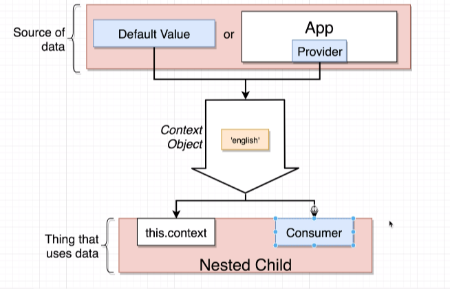
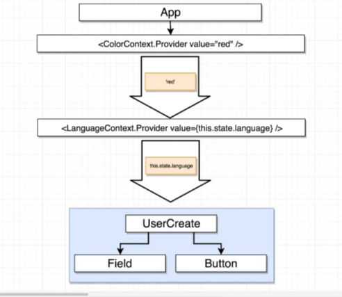

## React Context

### 1. Why Context

- Context is useful when passing data from a parent to a deeply-nested child component.

### 2. Context Object and Provider

- 

- Create a context object

```jsx
// LanguageContext.jsx
import React from "react";

export default React.createContext("english");
```

- Provide the context by accessing the Provider property, and pass the value prop.

```jsx
// App.jsx
import React from "react";
import { useState } from "react";
import UserCreate from "./UserCreate";
import LanguageContext from "../contexts/LanguageContext";

const App = () => {
  const [language, setLanguage] = useState("english");

  const onLanguageChange = (lan) => {
    setLanguage(lan);
  };

  return (
    <div className="ui container">
      <div>
        Select a language:
        <i className="flag us" onClick={() => onLanguageChange("english")} />
        <i className="flag nl" onClick={() => onLanguageChange("dutch")} />
      </div>
      <LanguageContext.Provider value={language}>
        <UserCreate />
      </LanguageContext.Provider>
    </div>
  );
};

export default App;
```

### 3. Context in Class-based Components

- In child component:

```jsx
import React, { Component } from "react";
import LanguageContext from "../contexts/LanguageContext";

class Field extends Component {
  static contextType = LanguageContext;

  render() {
    const text = this.context === "english" ? "Name" : "Naam";
    return (
      <div className="ui field">
        <label>{text}</label>
        <input type="text" />
      </div>
    );
  }
}

export default Field;
```

### 4. Context in Functional Components

- In child component:

```jsx
import React, { useContext } from "react";
import LanguageContext from "../contexts/LanguageContext";

const Button = () => {
  const language = useContext(LanguageContext);
  const text = language === "english" ? "Submit" : "Voorleggen";

  return <button className="ui button primary">{text}</button>;
};

export default Button;
```

### 5. Context Consumer

- A consumer is just a react component.
- Advantages of a consumer: when there are multiple context objects.


```jsx
import React, { Component } from "react";
import LanguageContext from "../contexts/LanguageContext";

class Field extends Component {
  // 1. use this.context
  // static contextType = LanguageContext;

  // 2. use Consumer
  // The consumer component will automatically call the function inside of it.

  renderLabel = (value) => {
    const text = value === "english" ? "Name" : "Naam";
    return <label>{text}</label>;
  };

  render() {
    // const text = this.context === "english" ? "Name" : "Naam";
    return (
      <div className="ui field">
        <LanguageContext.Consumer>
          {this.renderLabel}
        </LanguageContext.Consumer>
        {/* <label>{text}</label> */}
        <input type="text" />
      </div>
    );
  }
}

export default Field;
```

### 6. Takeaways

- Each context provider (if the same context object is used in multiple times) is a separate component, like an independent instance.
