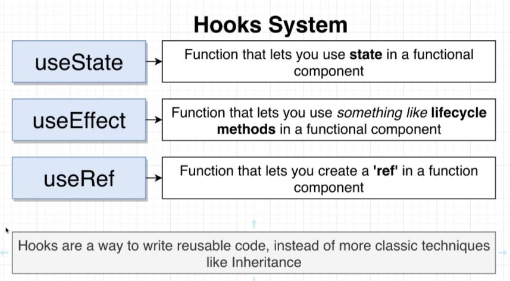
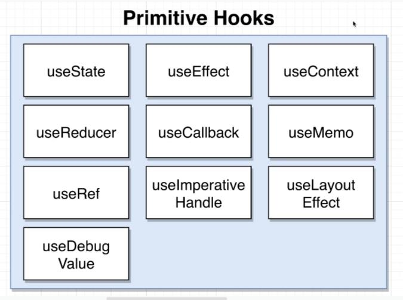
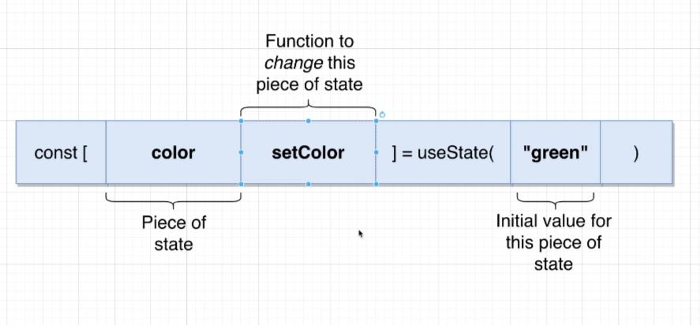
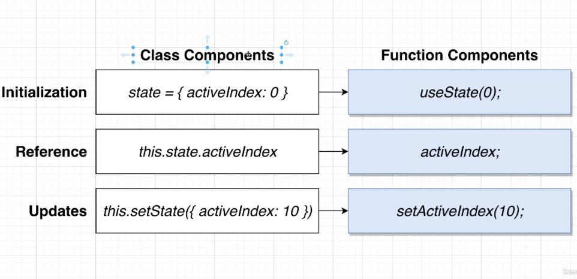
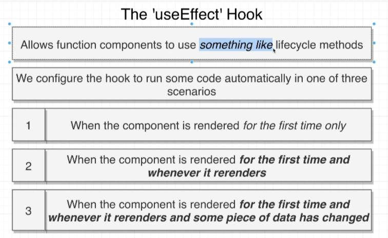
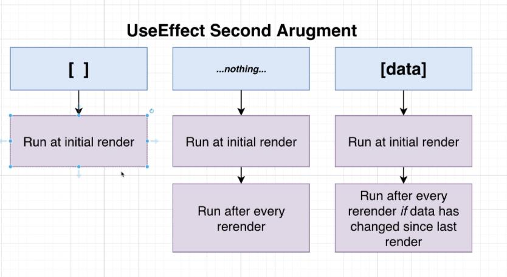

## React Hooks

### 1. Hooks System




custom hook
useTranslate

### 2. useState




In class components, it is easy to change multiple states in one time.

### 3. useEffect




- useEffect can't accept async function directly
- Solution 1: define an async fn inside the callback, and then call it
- Solution 2: IIFE
- Solution 3: traditional promises

```jsx
// Solution 1:
const search = async () => {
  await axios.get(
    `https://en.wikipedia.org/w/api.php?action=query&list=search&origin=*&format=json&srsearch=${term}`
  );
};
search();

// Solution 2:
(async () => {
  await axios.get(
    `https://en.wikipedia.org/w/api.php?action=query&list=search&origin=*&format=json&srsearch=${term}`
  );
})();

// Solution 3:
axios
  .get(
    `https://en.wikipedia.org/w/api.php?action=query&list=search&origin=*&format=json&srsearch=${term}`
  )
  .then((res) => console.log(res));
```

- 3.1 Debounce in useEffect

```jsx
const [term, setTerm] = useState("Evan You");
const [results, setResults] = useState([]);

useEffect(() => {
  const search = async () => {
    const { data } = await axios.get("https://en.wikipedia.org/w/api.php", {
      params: {
        action: "query",
        list: "search",
        origin: "*",
        format: "json",
        srsearch: term,
      },
    });
    setResults(data.query.search);
  };
  if (term && results.length === 0) {
    search();
  } else {
    let timer = setTimeout(() => {
      search();
    }, 2000);

    // THIS IS THE CLEAN-UP MECHANISM FOR THE EFFECT
    // React 会在组件卸载的时候执行清除操作。effect 在每次渲染的时候都会执行。React 会在执行当前 effect 之前对上一个 effect 进行清除。
    // when react first mounts, it will call this useEffect callback fn, and invoke 'changed'.
    // after that, the callback fn will return a function ('cleared') that will be called when the component unmounts.

    return () => {
      clearTimeout(timer);
    };
  }
}, [term]);
```

- 以上方法会有一个 warning: eslint 提示缺少 dependency: resullts。如果只是在数组中添加上这个依赖，会导致首次渲染时进行两次 ajax 请求，包含默认的首次请求和由于 results 更新导致的第二次相同 term 作为参数的请求。解决方法是创建一个新的 state，用来存储 debouncedTerm，用 debouncedTerm 进行请求，只用 term 去定时更新 debouncedTerm。

```jsx
const [term, setTerm] = useState("Evan You");
const [debouncedTerm, setDebouncedTerm] = useState(term);
const [results, setResults] = useState([]);

useEffect(() => {
  // 这里首次渲染时，给debouncedTerm赋值相同的值，所以不会触发debouncedTerm的重新渲染
  const timerId = setTimeout(() => {
    setDebouncedTerm(term);
  }, 1000);

  return () => {
    clearTimeout(timerId);
  };
}, [term]);

useEffect(() => {
  const search = async () => {
    const { data } = await axios.get("https://en.wikipedia.org/w/api.php", {
      params: {
        action: "query",
        list: "search",
        origin: "*",
        format: "json",
        srsearch: debouncedTerm,
      },
    });
    setResults(data.query.search);
  };
  search();
}, [debouncedTerm]);
```

### 4. useRef

- Native event listeners have a higher priority than React event listeners.

- useRef is a hook that lets you access the DOM node of a component.

```jsx
const ref = useRef();

useEffect(() => {
  // In React 16, all events are registered at the topmost DOM node, which is the <html> tag.
  // So e.stopPropagation() won't work: If a nested tree has stopped propagation of an event, the outer tree would still receive it.
  // In React 17, the events are registered at the root DOM container where React tree is rendered.
  document.addEventListener(
    "click",
    (e) => {
      // contains is the native method of the DOM
      if (ref.current.contains(e.target)) {
        return;
      }
      setOpen(false);
    },
    { capture: true }
  );
}, []);

return (
  <div ref={ref} className="ui form">
    <div className="field">
      <label>Select a Color</label>
      <div
        onClick={() => setOpen(!open)}
        className={`ui selection dropdown ${open ? "visible active" : ""}`}
      >
        <i className="dropdown icon" />
        <div className="text">{selected.label}</div>
        <div className={`menu ${open ? "visible transition" : ""}`}>
          {renderedOptions}
        </div>
      </div>
    </div>
  </div>
);
```

- Refactor: clean up event listeners
  - App.js

```jsx
const App = () => {
  const [selected, setSelected] = useState(options[0]);
  const [showDropdown, setShowDropdown] = useState(true);

  return (
    <div>
      {/* <br /> */}
      {/* <Accordion items={items} /> */}
      {/* <Search /> */}
      <button onClick={() => setShowDropdown(!showDropdown)}>Toggle me!</button>
      {showDropdown ? (
        <Dropdown
          selected={selected}
          handleSelectedChange={setSelected}
          options={options}
        />
      ) : (
        <p>Boo!</p>
      )}
    </div>
  );
};
```

  - Dropdown.js

```jsx
useEffect(() => {
  const onBodyClick = (e) => {
    if (ref.current.contains(e.target)) {
      return;
    }
    setOpen(false);
  };

  document.body.addEventListener("click", onBodyClick, { capture: true });

  // Clean up the event listener when the component is unmounted
  return () => {
    document.body.removeEventListener("click", onBodyClick, { capture: true });
  };
}, []);
```

- Fix: Too many re-renders error

```jsx
// remember to use arrow fn in click handler, otherwise, React will throw an error: too many re-renders
<button onClick={() => setShowDropdown(!showDropdown)}>Toggle me!</button>
```
