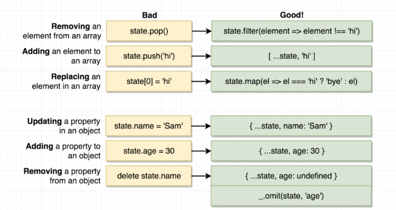

## Redux Form

### 1. Basics

- reduxForm is a function that creates a decorator with which you use redux-form to connect your form component to Redux. It takes a config parameter which lets you configure your form.

```jsx
import React from "react";
import { Field, Form, reduxForm } from "redux-form";

class StreamCreate extends React.Component {
  renderInput(formProps) {
    const { input } = formProps;
    // use spread operator to pass all props to input element
    return (
      // <input value={input.value} onChange={input.onChange}></input>
      <input {...input} />
    );
  }
  render() {
    return (
      <form>
        <Field name="title" component={this.renderInput} />
        <Field name="description" component={this.renderInput} />
      </form>
    );
  }
}

// reduxForm receives
export default reduxForm({
  form: "streamCreate",
})(StreamCreate);
```

- validate is a function that can be passed to reduxForm. It takes the values of the form and returns an object with errors.
- touched is like a blur event, which is used to detect if the user has interacted with the form.
- meta is an object that contains the error and touched properties.

```jsx
import React from "react";
import { Field, Form, reduxForm } from "redux-form";

class StreamCreate extends React.Component {
  renderError({ error, touched }) {
    if (touched && error) {
      return (
        <div className="ui error message">
          <div className="header">{error}</div>
        </div>
      );
    }
  }
  // input contains anything dom related
  // label is a custom prop that we provide to the component
  // meta contains validation info
  renderInput = ({ input, label, meta }) => {
    const className = `field ${meta.error && meta.touched ? "error" : ""}`;
    return (
      // <input value={input.value} onChange={input.onChange}></input>
      <div className={className}>
        <label htmlFor={input.name}>{label}</label>
        <input id={input.name} {...input} />
        {this.renderError(meta)}
      </div>
    );
  };

  onSubmit(formValues) {
    console.log(formValues);
  }

  render() {
    const { handleSubmit } = this.props;
    return (
      <form onSubmit={handleSubmit(this.onSubmit)} className="ui form error">
        <Field name="title" component={this.renderInput} label="Title:" />
        <Field
          name="description"
          component={this.renderInput}
          label="Description:"
        />
        <button className="ui button">Submit</button>
      </form>
    );
  }
}

const validate = (formValues) => {
  const errors = {};
  if (!formValues.title) {
    errors.title = "You must enter a title";
  }
  if (!formValues.description) {
    errors.description = "You must enter a description";
  }
  return errors;
};

// reduxForm receives
export default reduxForm({
  form: "streamCreate",
  validate, // pass validate method here
})(StreamCreate);
```

### 2. Redux New Object Creation Syntax


### 3. Useful Lodash Methods
- _.pick(object, [paths]) - Returns an object containing the picked object properties.