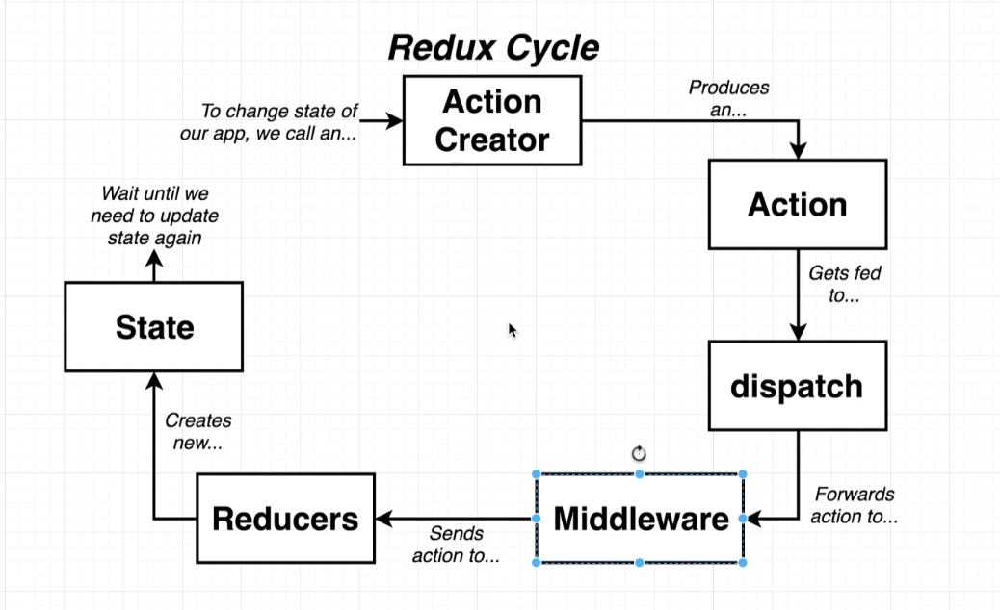
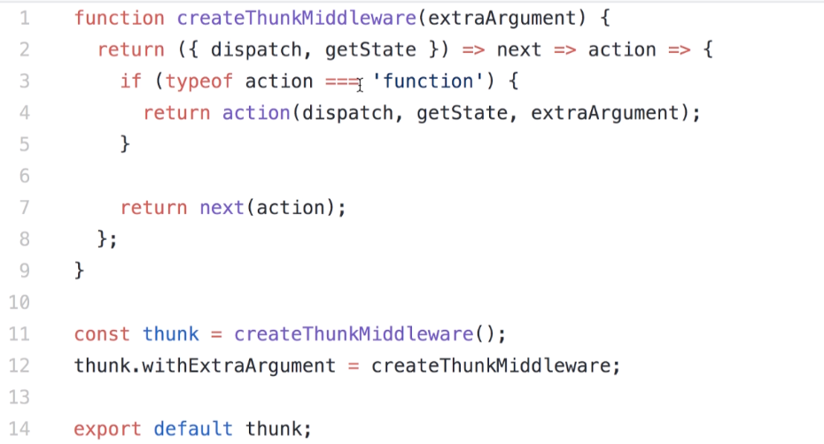

## Redux

### 1. Rules of Reducers

- Always return a new object, e.g. `[ ...state, ...newState ]`, NOT `state.push(newState)`; for deleting, use `state.filter(item => item.id !== id)`, instead of `state.splice(index, 1)`

### 2. Redux

- `{createStore, combineReducers}`
- In Redux, states are included in the reducers, along with the action.
  

### 3. React-Redux Library

#### 3.1 Provider (topmost of the hierarchy) -> App -> Connect => Component

```jsx
// index.js
import React from "react";
import { createRoot } from "react-dom/client";
import App from "./7. Songs/components/App";

import { Provider } from "react-redux";
// import { createStore } from "redux";
import { configureStore } from "@reduxjs/toolkit";
import reducers from "./7. Songs/reducers";

const store = configureStore({
  reducer: reducers,
});

// const store = createStore(reducers);

// Render the react component to the DOM
createRoot(document.getElementById("root")).render(
  <Provider store={store}>
    <App />
  </Provider>
);
```

#### 3.2 `connect` is a function that takes a component and returns a new component.

```jsx
import React, { Component } from "react";
import { connect } from "react-redux";

class SongList extends Component {
  render() {
    // this.props === {songs: state.songs}
    return (
      <div className="ui container">
        <h1>SongList</h1>
      </div>
    );
  }
}

const mapStateToProps = (state) => {
  return {
    songs: state.songs,
  };
};

export default connect(mapStateToProps)(SongList);
```

#### 3.3 connect function under the hood

```jsx
import React from "react";

export const connect = (mapStateToProps) => {
  return (Comp) => {
    const state = {
      songs: [
        { title: "No Scrubs", duration: "4:05" },
        { title: "Macarena", duration: "2:30" },
        { title: "All Star", duration: "3:15" },
        { title: "I Want it That Way", duration: "1:45" },
      ],
      favoriteTitle: "All Star",
    };

    return (props) => {
      return <Comp {...props} {...mapStateToProps(state)} />;
    };
  };
};
```

### 4. Summary & Reflection

- connect function takes two arguments, first being the mapStateToProps function, and second being the actions to be passed to the component.

- A reducer is a combination of state and actions. It always returns a state, and will mutate the state based on different action types.

### 5. Redux-Thunk

- actions must return a plain js object, instead of a promise(from async function);

```jsx
export const fetchPost = async () => {
  // This is a bad practice and will show error message in the console
  const response = await axios.get("/posts");

  return {
    type: "FETCH_POST",
  };
};
```

- Redux-Thunk can return either an action or a function. It's like calling dispatch 2 times. The first time, it dispatches a plain object (a function) and this async function calls an api and manually dispatches another action. The second time, the synchronous action gets dispatched, and moves on to the reducer stage.



```jsx
// redux-thunk behind the scnes
export const fetchPost = () => {
  return function (dispatch, getState) {
    const promise = axios.get('/posts');

    return {
      type: "FETCH_POST",
      payload: promise

    }
  }

}
```

- RTK built-in thunk
```jsx
// index.js
import { Provider } from "react-redux";
import { configureStore } from "@reduxjs/toolkit";
import reducers from "./8. Blog/reducers";
import axios from "./8. Blog/api/jsonPlaceholder";

const store = configureStore({
  reducer: reducers,
  middleware: getDefaultMiddleware => 
    getDefaultMiddleware({
      thunk: {
        extraArgument: axios
      }
    })
})
```

```jsx
// actions/index.js
export const fetchPost = () => {
  // the extraArgument from configureStore is the 3rd argument
  return async function (dispatch, getState, api) {
    const response = await api.get('/posts');

    dispatch({type: 'FETCH_POST', payload: response})
  }
}
```

// TODO

1. learn RTK
