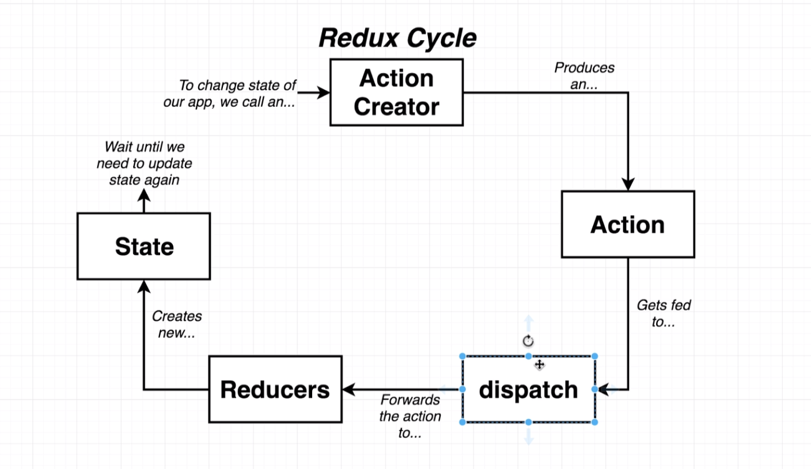

## Redux

### 1. Rules of Reducers

- Always return a new object, e.g. `[ ...state, ...newState ]`, NOT `state.push(newState)`; for deleting, use `state.filter(item => item.id !== id)`, instead of `state.splice(index, 1)`

### 2. Redux

- `{createStore, combineReducers}`
- In Redux, states are included in the reducers, along with the action.

