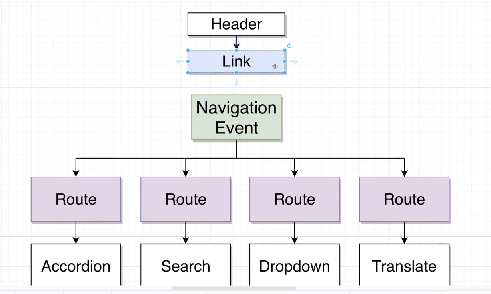

## React Router

### 1. Basic Component Routing

- Native browser routing is done by window.location and the anchor tag.
  - drawback: each time the path changes, the page is reloaded, fetching new data from the server, including all the html, css, and js files
  - fix: `window.history.pushState({}, '', newPath);`

### 2. React Router Mechanism



- Link.js is a component that wraps an anchor tag with a custom onClick handler, registering a popState event.

```jsx
const Link = ({ className, href, children }) => {
  const onClick = (e) => {
    // mock default browser behavior
    // metaKey is for mac, ctrlKey is for windows
    if (e.metaKey || e.ctrlKey) {
      return;
    }
    e.preventDefault();
    window.history.pushState({}, "", href);

    const navEvent = new PopStateEvent("popstate");
    window.dispatchEvent(navEvent);
  };
  return (
    <a className={className} href={href} onClick={onClick}>
      {children}
    </a>
  );
};
```

- Route.js is a component that conditional renders the children prop based on the current path.

```jsx
const Route = ({ path, children }) => {
  const [currentPath, setCurrentPath] = useState(window.location.pathname);

  useEffect(() => {
    const onLocationChange = () => {
      setCurrentPath(window.location.pathname);
    };
    window.addEventListener("popstate", onLocationChange);

    return () => {
      window.removeEventListener("popstate", onLocationChange);
    };
  }, []);

  return currentPath === path ? children : null;
};
```

- App.js lists all the routes and renders them.

### 3. React Router Dom

- Bad practice: use `<a>` instead of `<Link to="#">`, then the browser will fetch chunk(HTML/CSS/JS) from the server again, which means dumping the old chunk, incl. stats, JS variables, etc.

- #### 3.1 Router Types
- It's all about deployment. Hash routing is for browser routing, which behaves likes SPA.
  -- `BrowserRouter`: for browser routing
  -- `HashRouter`: for hash routing
  -- `MemoryRouter`: for memory routing

- `<Link>` should always be used inside `<Router>`